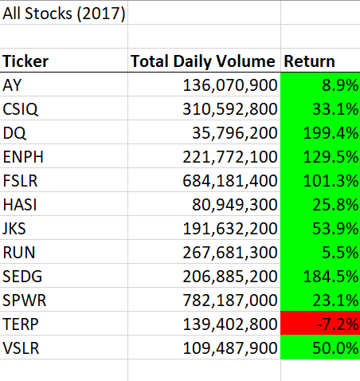
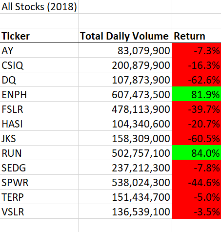
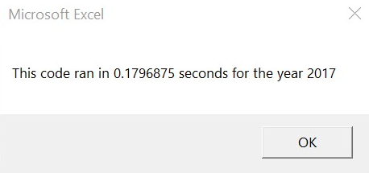
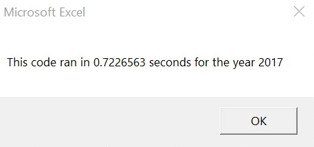
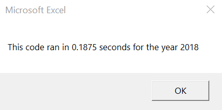
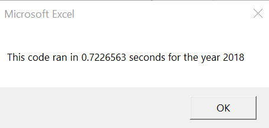

# Stock Analysis in Excel using VBA
Performing analysis on green energy stock data to uncover stock performance.

## Overview of Project

Steve just graduated with a Finance degree. Steve's parents are going to be his first clients. Steve's Parents are passionate about green energy and decided to invest all their money into DAQO New Energy Corporation, a company that makes silicon wafers for solar panels. Steve is looking into DAQO stocks for his parents. Steve also wants to analyze a handful of green energy stocks so he can diversify the investment for his parents. The purpose of this project is to create a VBA Script to analyze green energy Stocks for Steve's Parents. Also, create VBA Script with performance measures that can be reused for any stocks. 

### Purpose
The purpose of this analysis is to help Steve analyze green energy stocks for Steve's parents to uncover stock performance and build a reusable VBA script with performance measures that can be used with any stocks.

## Results 

DAQO(DQ) stocks return dropped over 62% in 2018 (See image below). Based on analysis Steve should advise his parents against buying DQ Stocks.

_Stocks_Result.png)

ENPH and RUN stocks return was over 129% and 5% respectively (See image below All Stocks (2017)). ENPH and RUN stocks return was over 82% and 84% respectively (See image below All Stocks (2018)). A recommendation can be made by Steve to his parent to invest in ENPH and RUN stocks. Steve should recommend investing in both funds since he wants to diversify investment for his parents. 
 

2017 Refactored All Stock Analysis excution time:

2017  All Stock Analysis excution time:

2018 Refactored All Stock Analysis excution time:

2017  All Stock Analysis excution time:

2017 and 2018 Refactored All Stock Analysis execution time is approximately 54 seconds faster than the 2017 and 2018 All Stock Analysis (Original). 

## Summary
What are the advantages or disadvantages of refactoring code?

Advantages 
>- Refactoring improves the Design of software
>- Refactoring makes software easier to understand
>- Refactoring helps finding and fixing Bugs
>- Refactoring helps programming faster

Disadvantages
>- It is expensive and risky in the view of management. Higher Cost.
>- Time consuming 
>- It may introduce bugs 

Sources: [Stackflow](https://stackoverflow.com/questions/43983284/what-are-the-advantages-and-disadvantages-of-refactoring-code-smell-in-software), [Website: C# Corner](https://www.c-sharpcorner.com/article/pros-and-cons-of-code-refactoring/)

How do these pros and cons apply to refactoring the original VBA script?
> - Based on the execution time difference between original and refactored script it can be concluded that refactored script ran faster. The refactored script design was improved. Also, the refactored script was easier to understand. 
> - Refactoring of the script caused bugs that required additional or extra time to fix.
